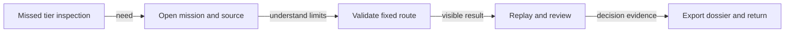
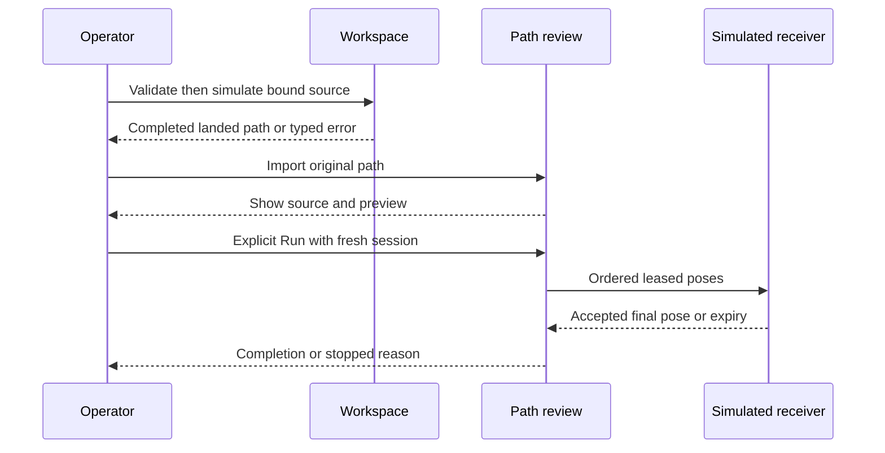
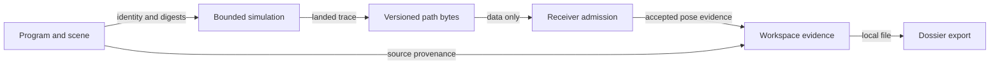
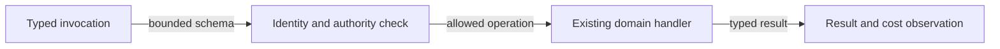
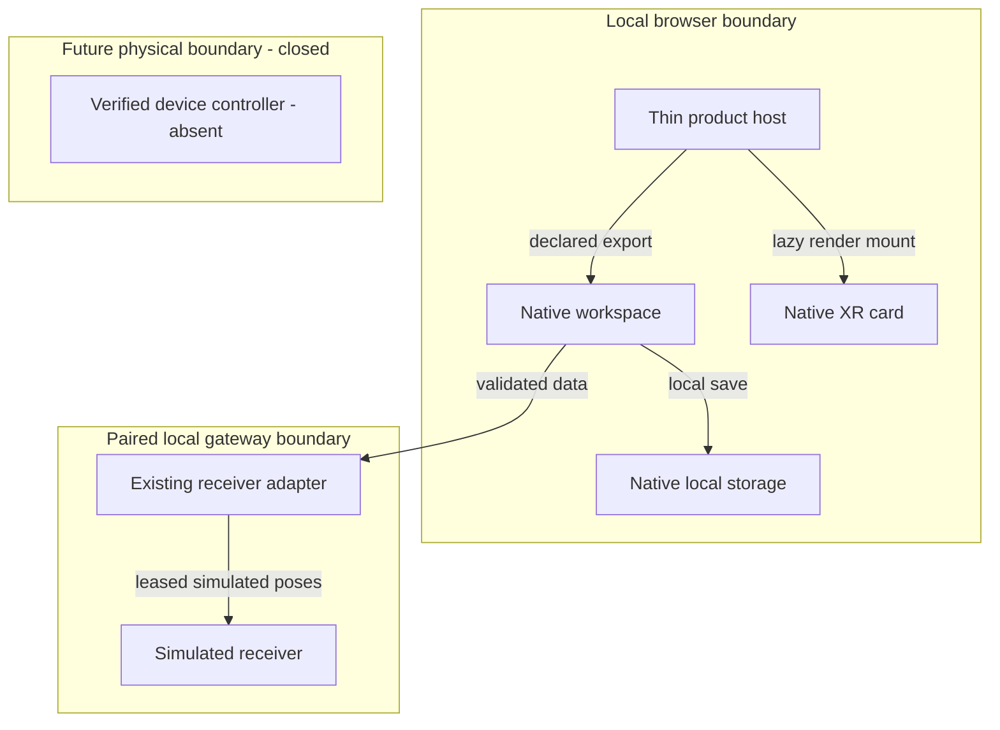

# Reference implementation — TAD and reuse

Consumes [PRD-01–10 and A1–A5](prd-tad-adr-mvp-gtm.md) at `agentic-drone-dashboard@0.1.0`. Source IDs and file digests resolve through [source-grounding.json](source-grounding.json). **G** is Graph canonical `adadad351f37ae7f546101fac64e22acd834fbed`; **GL** is the inspected clean drone-learning worktree `5d729f787b3b5f73cc168a2494b003ba377edd8c`; **X** is GameXR `a9340b3c8dfca66623a975d54b9601a803595e9d`. GL serves port 4198, confirmed from the listener process working directory. These are inspected references, not accepted production pins. Final readback observed independent GL drift to `ea93888c30aa6dc1b4790aa2870b9e8358ba301e` with dirty owner paths; the retained source snapshot remains inspectable, and lesson-bootstrap integration must be re-grounded. The supplied port 54842 was not listening during this session; its screenshot is historical UI evidence.

## Reference implementation — component inventory and reuse

“Source” below is the existing implementation owner, not a promise that the symbol is publicly exported. Never import a sibling repository's `src` path. Proposed product owners are explicitly NEW.

| ID / responsibility / PRD | Exact source or symbol at pin / existing consumer | Decision / minimum delta / compatibility check |
|---|---|---|
| C1: product host composes cards / 01,08 | Target README at T pin; no app/server/package today | NEW thin composition entry and scenario manifest in target after admission. Consume owner builds/declared exports; no copied app. E1,E3; retain Launch Copilot reference |
| C2: mission dashboard projects evidence / 01 | GL `canvas/src/components/DashboardCanvas/index.tsx`; `features/agent-ready/agentMissionDashboardSnapshot.ts::readMissionDashboardSnapshot`; current consumer Graph | REUSE source-file → Dashboard route and native cards. `agent-mission.manifest.json` is an OS workflow artifact, not an aircraft command. Keep historical/unevaluated labels; E1 |
| C3: workspace owns program views / 02 | GL `features/markdown-workspace/main/useInitialWorkspacePaneVisibility.ts`; `features/python-learning/PythonLearningPane.tsx`, `learningRuntime.ts`; current consumer native editor | REUSE Python/Block/JSON and bounded learning runtime. NEW fixed farm scenario via owner extension. JSON is the owner's projection, not a separate language; E1/E2 roundtrip and stale digest |
| C4: library owns insertion / 02 | GL `features/toolbar/FloatingPanelBlockLibraryView.tsx::FloatingPanelBlockLibraryView`; `features/block-editor/blockLibrary.ts::BLOCK_DEFINITIONS` | REUSE FloatingPanel and session target insertion. No new block catalogue. Unsupported Python must show a diagnostic; preserve source; E1/E2 |
| C5: XR owner renders route / 03 | GL `features/three/xrSceneSurfaceRuntime.ts`, `features/python-learning/LearningSceneStage.tsx`, `learningCanvasEmbedProtocol.ts`; existing scene/editor consumers | EXTEND OWNER to expose lifecycle-bound XR preview in a Dashboard card. Current widget template enum lacks XR. Existing learning canvas is render-only and does not itself prove XR-mode parity; E1/E3 |
| C6: exporter serializes simulation / 04 | GL `features/python-learning/learningFlightPath.ts::createLearningFlightPath`, `learningFlightTransfer.ts::createFlightReviewUrl`; consumer X | REUSE v1/v2 data and review link/file/copy routes. Source/scene digests identify origin; no copied simulator. E2 accepted/rejected byte fixtures |
| C7: receiver owns admission and execution / 04,05 | X `src/drone/FlightPath.ts::readFlightPath,FlightPathRun`, `FlightPathView.ts`, `protocol.ts`, `tools/drone-bridge/receiver-state.ts` | REUSE path review, explicit Run/Stop and leased simulated receiver. RETAIN independent consumer validation and current errors; product hides/excludes manual axes, motion and game controls. E2 fault tests |
| C8: farm evidence joins observations / 06,09 | Native workspace storage/exports from C3; farm metadata/coverage join absent | NEW farm domain annotation adapter only: point/rack/tier/time/capture reference/reviewer. Reuse storage/export; no second database. Synthetic assets visibly labelled. E1 export/readback |
| C9: invocation adapter resolves one owner / 05,07 | GL `dashboardWidgetToolContract.mjs`, `learningToolContract.mjs`, `learningWebMcp.ts`; X `src/mcp/contracts.ts` | REUSE tool schemas and dispatch. EXTEND OWNER for missing drone-path agent routes; `gamexr.control_runtime` is game scene control, not DronePanel control. E2 denies unsupported cross-surface effects |
| C10: physical executor owns control / 10 | X firmware README explicitly excludes flight; requested S3 controller not established | DEFER. Exact board, sensors, firmware, stabilization, localization, actuator interface and physical failsafe evidence required. No reinterpretation of simulated path as motor commands; E5 |

No generic utility extraction yet. C6 has two actual consumers (GL export and X import), but they have deliberate producer/receiver admission differences. A3 retains them behind the versioned protocol; extraction needs its own parity fixtures and ADR only if measured drift warrants it. No superseded runtime is created in this increment, so nothing is deleted and no shim is needed.

Consumer pin procedure: validate owner exports/build manifest → record exact source/artifact digests and licenses → bind target dependency/lock → test protocol mismatches and limits → adopt adapter. X currently consumes vendored spatial-review/apple-input/grph-shared packages and an OS development tarball at `f6d03945ab297281ded6b702ae96d24d2b94c14e`; that is not the OS checkout used for this preflight. Record these differences rather than silently refreshing them.

## Reference implementation — native design adoption

| Concern | Existing owner at GL | Reuse / acceptance / gap |
|---|---|---|
| Settings, tokens, typography | `canvas/src/lib/ui/theme-tokens.ts::UI_THEME_TOKENS`; workspace toolbar/settings | Native token consumption and code font; E3 verifies contrast, focus, zoom. Exact font/icon assets and distribution licenses require audit |
| Identity/illustration | Native renderer assets; no new logo commissioned | Product title only; retain source asset provenance; E3 checks no missing icons |
| Editor and library | C3/C4 | One active document/session shared by panes; E1 edits one block and reads source/JSON |
| Card shell/layout/status | C2 DashboardWidgetBoard, layout, disclosure owners | Native cards and unknown/stale status. No green “safe to fly” derived from simulation |
| XR adapter | C5 | Native scene lifecycle mounted once, disposed on close; E3; new Dashboard card seam remains a gap |

## Reference implementation — interface and state contracts

**Portable path (existing).** `agentic-drone-flight-path/v1` or `/v2`; `model:kinematic`, `physicalAircraft:false`, `tickRate:60`, `coordinateFrame:local-xz-altitude-m-heading-deg`, 64-hex `sourceDigest` and `sceneDigest`, samples `[tick,x,z,heading,altitude]`; v2 adds `sourceUrl`. The producer requires completed, landed, collision-free simulation. Consumer limits: ≤500,000 UTF-8 bytes, 2–7,201 samples, sequential ticks from zero, origin first pose, last altitude zero, bounded coordinates and ≤0.050002 m translation per tick. These simulation limits are not physical clearances or recommended flight speeds. Paths at the byte boundary must retain current owner semantics; new emitted chunks stay strictly below 500,000 bytes.

**Preview (existing).** `agentic-graph/learning-canvas/v1` carries bounded pose tuples with origin/source/channel checks. X `GraphCanvasPreview` mounts a trusted local Graph build only after verifying `agentic-graph/learning-canvas-artifact/v1`, exact entry/base/protocol and a source revision. It is render-only. No source code, control grant, arbitrary URL or physical authority crosses this seam. Missing artifact has a visible fallback and native source link.

**Execution (existing simulated mode).** `simulated-drone-path/v1`: `{kind:path,profile,session,challenge,sequence,pose}`. Session mode excludes manual axes. Receiver admission uses a one-use challenge, increasing sequence and 250 ms lease; browser sender chooses samples approximately every 40 ms. `FlightPathRun` rejects a jump of more than 12 ticks and requires exact final receiver acceptance. Stop invalidates the run; a new Run starts at zero. No background catch-up or auto-resume.

**Farm annotation (proposed domain contract).** A versioned document holds `missionRef`, original path reference/digests, coordinate-frame/calibration reference, and at most 128 points with `pointId,rackId,tierId,plannedPose,captureRef,captureTime,provenance,reviewState,reviewNote`. `provenance` distinguishes synthetic fixture, imported real camera evidence and measured onboard capture. Reuse existing workspace store and attachment APIs; store file digests separately, never overwrite original path digests. No coordinates are claimed calibrated to a farm until a calibration record exists.

**State distinctions:** draft → validated simulation → replay complete → imported review → explicitly running simulated receiver → receiver-acknowledged completion, or stopped/error. These are domain run states, not artifact readiness rungs. New source/scene edits invalidate validation and run identity; async results carry document/run/generation identity; late results cannot overwrite current state. Single session owns a receiver, second writer refused. Shared inspection is read-only; multi-device editing uses native conflict rules. Offline file exchange is not real-time sync.

## Reference implementation — invocation register

One register below maps capability identity to surfaces. “Proposed” routes are reserved design examples, not callable promises. Discover actual owner capabilities at runtime; do not invent a second registry. Invocation is never authorization. All discovery/inspection/render paths are deterministic with zero model tokens.

| Capability / owner | Browser and API/tool | `/`, `#`, `@` binding | Current support and effect boundary |
|---|---|---|---|
| C2 widget configuration | `control_local_widget`; WebMCP `agentic-graph.control_local_widget` | Existing `/canvas.widget #widget @dashboard` | Browser edits active workspace; native MCP transforms supplied document and returns config. `create` requires editable Storyboard, not Dashboard. Neither exposes XR card today |
| C3 inspect program | `inspect_local_python_learning` through existing WebMCP builder | Proposed `/drone.inspect #mission @active-program` resolves to same schema | Read-only active identity; native MCP live-browser parity unverified. No remote execution assumed |
| C3 operate simulation | `control_local_python_learning`: validate/run/step/pause/stop/reset/hint/save | Proposed `/drone.simulate #flight-path @active-program` | WebMCP binds workspace/document/source/scene/lesson/runtime/seed/expectedRunId plus requestId. Save separate; at most 5 completion inspections; no model/source edit |
| C4 insert block | Native FloatingPanel/session insertion | No verified independent `/@#` or MCP tool | Browser supported; proposed adapter must call existing insertion owner with explicit target and stale check. Otherwise return unsupported |
| C5 preview | Native surface selection, learning pose channel | Proposed `/drone.preview #flight-path @xr-card` | Browser scene owner reused; card seam new. HTTP trusted build serves render-only artifact; no effect route |
| C6 transfer | Native Results → review link, copy/file | Existing URI `#flight` is encoded data, not semantic tag or execution grant; source uses `kgDoc` | ≤12,000 compressed bytes / ≤16,000 encoded characters for review link; file fallback. Import never executes |
| C7 run path | Native DronePanel path Run/Stop + local gateway | Proposed `/drone.run #flight-path @simulated-receiver`; proposed `/drone.stop` same owner | Existing UI effect, missing dedicated MCP/WebMCP path tool. Proposed only after owner schema and receipt binding; explicit run authority, no generic game-control fallback |
| Game scene inspection | `gamexr.inspect_runtime`, `gamexr.control_runtime` | No verified `/@#` aliases for DronePanel | Existing WebMCP concerns game runtime; control includes manual game axes. Do not expose its set-controls through this product |
| C8 dossier | Existing native workspace export; farm join new | Proposed `/drone.export #scouting-evidence @mission` | Prepare/export local bytes only; no upload/send/physical effect |

Requested MCP/WebMCP interoperability is therefore **partially existing**. HTTP serves artifacts/gateway; browser owns live sessions; native MCP document transformation is not browser execution. Missing routes have C9/E2 as owner and next check. No complete transport parity claim.

## Reference implementation — five flows and diagram register

All five flows cover PRD-01–08 as one vertical journey; PRD-09 uses the exported dossier in E4; PRD-10 stays behind the device boundary. Each diagram is version 0.1.0, dated 2026-09-27. Flowchart is the declared primary projection; the multi-actor sequence is static workflow notation, with its projecting structural companion in D3/D5. Projection counts and limitations are recorded in validation; no diagram is runtime proof.

**Diagram D1** · Class: User Journey · Notation: Mermaid LR · Version: 0.1.0
**Caption:** A farm lead reaches inspectable evidence before making a pilot decision.

| Node | Inventory responsibility / requirement |
|---|---|
| j1 | P1 trigger |
| j2 | PRD-01,02 discovery |
| j3 | PRD-02 validation |
| j4 | PRD-03–05,08 review |
| j5 | PRD-06 export, PRD-09 return |

**Diagram D2** · Class: Workflow · Notation: Mermaid sequenceDiagram · Version: 0.1.0
**Caption:** Import and preview remain separate from explicit receiver execution.

| Participant | Inventory / alternate / error / postcondition |
|---|---|
| O | One operator; may Stop at any point |
| W | C3,C6; invalid source → no export |
| P | C7; file import when link unavailable; missing receiver → replay-only |
| R | C7; lost lease → stopped, fresh Run required; final acknowledgment completes |

**Diagram D3** · Class: Data Flow · Notation: Mermaid LR · Version: 0.1.0
**Caption:** Source and observations retain provenance through a local evidence export.

| Node | Inventory / persistence |
|---|---|
| d1 | C3 authored source in native workspace |
| d2 | C3 bounded runtime in memory |
| d3 | C6 portable export file; original bytes retained |
| d4 | C7 session memory; no persisted command queue |
| d5 | C8 annotations/references in native workspace; captures opt-in |
| d6 | C8 user-selected local export; no automatic upload |

**Diagram D4** · Class: Orchestration / Harness · Notation: Mermaid LR · Version: 0.1.0
**Caption:** The MVP routes deterministic calls and never places a language model in control.

| Node | Inventory / harness constraint |
|---|---|
| h1 | C9 dispatcher; rejects unknown routes |
| h2 | Native binding checks; no approval inferred from manifest |
| h3 | C2–C7 existing handlers; finite simulation, max five completion reads |
| h4 | Native result observation; zero model tokens; error stops dependent work |

Optional AI authoring is deferred. If later admitted: typed request → bounded source proposal → deterministic validator → review, max 2 generations / 8,000 total tokens / 30 s, stop on no valid proposal; model cannot dispatch controls. FOSS model/license and local resource headroom must pass first; fallback is existing authored route. Record model, input/output/cache tokens and economic/cash cost separately. No LLM is needed for this MVP.

**Diagram D5** · Class: Topology · Notation: Mermaid TB · Version: 0.1.0
**Caption:** Local product views consume native owners; physical execution is a separate closed boundary.

| Node / cluster | Inventory / lane / connection / residency |
|---|---|
| browser | Authoring; client trust boundary; device-local |
| host | C1 view composer; no hardware authority |
| editor | C3/C4/C6; local calls and structured messages |
| xr | C5; read-only render lifecycle |
| store | C3/C8 storage; device-local, user-controlled export |
| local | Authoring demo gateway; LAN/process boundary |
| gateway | C7; paired HTTPS/WebSocket to loopback receiver |
| bench | C7; ordered simulated messages, memory only |
| device | Future delivery boundary; no connecting edge is intentionally authorized |
| controller | C10 absent; device-resident real-time control required later |

## Reference implementation — quality, threats and physical feasibility

Browser/UI target: <2 s warm local mission open and ≥30 fps inline replay on the selected test phone; ≤100 ms visible Stop response target does not supersede receiver expiry. Record device/browser, cold/warm load, bytes, memory and measured frame rate; unknown until E3. Gate native XR on capability and secure context; inline fallback required. Offline shell after explicit first provisioning is distinct from an offline LAN receiver and from fresh installation without assets.

Validation must exercise oversized/unknown schemas, digest mismatch, duplicate requestId, replayed challenge, out-of-order sequence, two competing clients, stale scene, hide/close, lost Wi-Fi and late asynchronous completion. Reject malformed import and clear prior accepted selection. A path source URL opens only on a click; source link is not proof that today's file matches the exported digest. Treat imported labels, notes and code as data; escape render content and never let embedded instructions grant tool authority.

Farm captures are private by default. Camera starts only explicitly; no audio; disable on hide/unmount, resolve late grants safely. Default raw captures remain session-local unless saved; suggested saved retention 30 days with a visible limit, export and delete. No automatic cloud sync, analytics or training. If storage quota is exceeded, stop capture visibly and offer export; never silently evict the current evidence. Backup/export and restore must round-trip identity. Define access controls for shared devices before a farm trial.

Physical feasibility is not established by a small board. Required inputs: exact module/board/revision, all-up guarded diameter/mass, payload and camera/lens/illumination, battery/endurance/thermal headroom, IMU calibration, range/altitude sensing and continuously adequate localization. Rack-end markers alone may leave long occluded/repetitive aisles unobservable; verify error through the aisle or add a justified sensing method. No “dead reckoning is enough” assumption.

For each aisle require measured `width > guardedDiameter + 2*(validated lateral error bound + plant movement allowance + clearance margin)` and equivalent vertical clearance. Determine values from site/device evidence; simulated radius and bounds cannot supply them. Preflight rejects missing calibration, stale pose, low energy reserve, blocked landing zone or containment geometry. During execution deterministic device failsafes must handle pose loss, link loss, low battery, obstacle incursion and sensor failure without manual recovery. A generic motor-off action may be unsafe airborne; the controller/site safety owner must verify the selected abort/landing response before any sortie. Browser/Wi-Fi never hosts stabilization timing.

No safety certification, flight suitability, crop sanitation, rotor-wash harmlessness or legal exemption is claimed. These are load-bearing VCC-10 dependencies with an owner and test, not ceremonial gates added to documentation.

## Reference implementation — ecosystem and licensing

| Participant | Value / interface / authority | Evidence / cost / exit |
|---|---|---|
| Farm buyer | Dossier and later scouting evidence; contract permits only stated deliverable | Pain/WTP unknown; own data/export; no inferred marketing permission |
| Scout/agronomist | Time-linked images and coverage; reviews anomalies | Image usefulness and review time unmeasured; can reject/annotate, not diagnose automatically |
| Integrator | Existing exports/tools; pins and supported capabilities | C2–C9 source evidence; no second registry; versioned file exit |
| Runtime maintainers | Retain existing owner contracts and release boundaries | GL `config/license-registry.json` classifies application-source as `NONE-private` and browser build artifacts as `LicenseRef-airvio-no-reuse-1.0`; these are not FOSS grants. A matching explicit FOSS-compatible grant or differently licensed native export is required before code distribution. Existing private surfaces can be inspected; this plan grants no relicensing |
| Device maintainer | Owns calibrated controller and independent failsafe proof | S3 flight owner absent; physical costs unknown, no purchase/flash |
| Assurance mechanism | Parses receipts and evaluates VCC outputs independently | Document checks are narrow; no self-grading production status |

Graph implementation reuse is a confirmed licensing constraint under the requested FOSS-only rule, not yet an admissible distributed dependency. A rights-holder decision/export is an external prerequisite; recheck on a concrete grant, with no ETA. GameXR declares MIT; dependency and asset notices still require audit. No vendor SDK, proprietary model or paid hosting is introduced. Local static/browser and local gateway variants each have $0 incremental service spend targets; hardware, electricity, setup and support time remain separate unknown economic costs. Public free hosting is deferred until license, quota/reset/headroom and stop/local fallback are recorded. No quota exhaustion may authorize paid overage.
